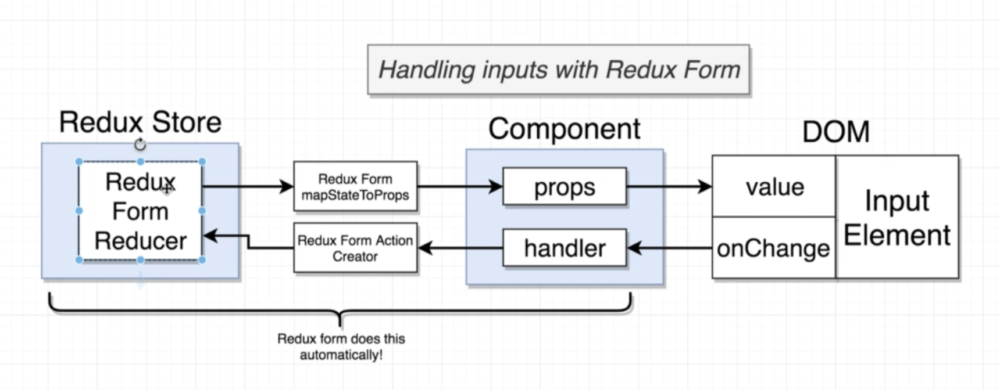

# Redux Form

[Redux Form Documentation](https://redux-form.com/)

## Migration to React Final Form
After I'm done with the initial build of the app, I could [migrate to React Final Form](https://final-form.org/docs/react-final-form/migration/redux-form).

It seems like Redux Form is no longer going to be updated.

The migration to Final Form is fairly simple and can be found   [here](https://www.udemy.com/course/react-redux/learn/lecture/26637172#questions).

